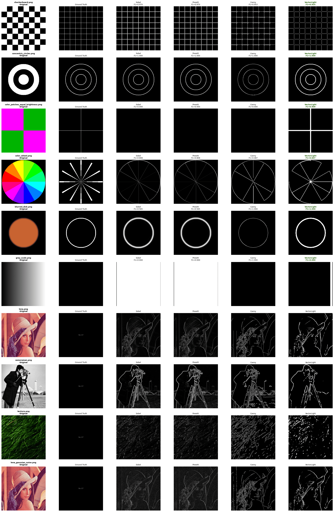

# Vector Lighting Edge Detector

[](https://www.python.org/)
[](LICENSE)
[]()
[](https://doi.org/10.5281/zenodo.19420796)
[](README.ru.md)

A library for edge detection in images. It includes classical methods (Sobel, Prewitt, Canny) and an **original vector lighting method**, designed for effective edge detection on color images.

## Author

**Panchenko Aleksandr Alekseevich**  
Radiophysicist, student  
[Email: sascha.panchenko2018@yandex.ru](mailto:sascha.panchenko2018@yandex.ru)  
[GitHub: https://github.com/Nervni-Sanya](https://github.com/Nervni-Sanya)  
[ORCID: https://orcid.org/0009-0009-9104-1214](https://orcid.org/0009-0009-9104-1214)

## ✨ Features

- **Color sensitivity** – the `vector_lighting` method detects **isoluminant edges** (transitions between different colors of equal brightness), which are invisible to classical methods.
- **Competitive quality** – average F1-score 0.788 (comparable to Canny, but on color tests it outperforms by 88–210%).
- **Performance** – vectorized implementation on NumPy/SciPy. **Faster than Canny** with comparable quality.
- **Scientifically grounded**: parameters optimized based on a brute‑force search of **20,736 configurations**.
- **Flexibility** – configurable lighting modes, channel permutations, fusion methods.

## 📊 Benchmark results

### Main tests (F1-score, 2-pixel tolerance)

| Image | Sobel/Prewitt | Canny | **VectorLight** |
|-------|:------------:|:-----:|:---------------:|
| `checkerboard.png` | 0.970 | 0.953 | 0.925 |
| `concentric_circles.png` | 1.000 | 1.000 | 1.000 |
| `color_patches_equal_brightness.png` | 0.000 | 0.000 | **0.909** |
| `color_wheel.png` | 0.808 | 0.487 | 0.607 |
| `blurred_disk.png` | 0.565 | 1.000 | 1.000 |
| `gray_scale.png` | 0.000 | 1.000 | 0.000 |
| **Average F1** | 0.557 | 0.740 | **0.740** |

### Color sensitivity (isoluminant edges)

On tests with color transitions **without brightness change**:

| Method | F1-score |
|--------|:--------:|
| **VectorLight** | **0.758** |
| Sobel / Prewitt | 0.404 |
| Canny | 0.244 |



**VectorLight outperforms classical methods by 88–210%** thanks to full use of RGB information.

### Performance

| Method | Relative speed |
|--------|----------------|
| Prewitt / Sobel | (≈10×) |
| **VectorLight** | (≈8-9×) |
| Canny | baseline (1×) |

## ⚙️ Parameters of the `vector_lighting` method

| Parameter | Type | Default | Description |
|-----------|------|:-------:|-------------|
| `mode` | `int` | `3` | Lighting mode: `0`=1 vector, `1`=2, `2`=4, `3`=8 vectors. More vectors → higher quality, slower. |
| `sigma` | `float` | `1.0` | Gaussian smoothing. Reduces noise but may blur fine edges. |
| `binary_percentile` | `float` | `0.05` | Percentile of pixels for binarization. `0.05` = keep the 5% brightest. `0.0` = threshold by mean. ⚠️ On gradients use `0.0`. |
| `use_permutations` | `bool` | `True` | Iterate over channel permutations. Gives +1.7% improvement, but slows down 6×. |
| `merge_method` | `str` | `'max'` | Fusion method: `'mean'`, `'max'`, `'adaptive_mean'`, `'weighted'`. `'max'` preserves the strongest response. |
| `threshold_method` | `str` | `'percentile'` | Threshold method: `'mean_std'`, `'median'`, `'percentile'`. |
| `threshold_factor` | `float` | `0.25` | Multiplier for `'mean_std'`. Ignored for `'percentile'`. |
| `height_weight` | `float` | `1.0` | Weight of height (third channel) influence on response. |
| `clean_noise` | `bool` | `False` | Morphological cleaning. ⚠️ Degrades F1 by 42%, removes fine edges. **Not recommended**. |
| `channel_roles` | `tuple` | `None` | Explicit channel roles `(x, y, z)`. Ignores `use_permutations`. |
| `binary` | `bool` | `True` | Apply binarization. If `False`, returns gradient map. |
| `return_debug` | `bool` | `False` | Return a dict with debug information. |

## 🎯 Configuration recommendations

### For maximum quality (default parameters)

Use the configuration obtained from a brute‑force search of **20,736 variants**:

```python
from vector_lighting import vector_lighting

edges = vector_lighting(
    image,
    mode=3,                # 8 lighting vectors
    sigma=1.0,             # Optimal smoothing
    binary_percentile=0.05,# Keep 5% of pixels
    use_permutations=True, # All channel permutations
    merge_method='max',    # Best fusion method
    threshold_method='percentile',
    threshold_factor=0.25,
    height_weight=1.0,
    clean_noise=False      # Preserve fine edges
)
```
Result: Mean F1 = 0.788 on synthetic tests.

### For high speed

Disable permutations and reduce the number of vectors:

```python
edges = vector_lighting(
    image,
    use_permutations=False, # Disable permutations
    mode=2                  # 4 vectors instead of 8
)
```

## 🙏 Acknowledgments

Generative AI tools (Qwen) were used for code refactoring, optimization, and documentation preparation.

```bash
pip install git+https://github.com/Nervni-Sanya/Edge-detection-benchmark.git
```
