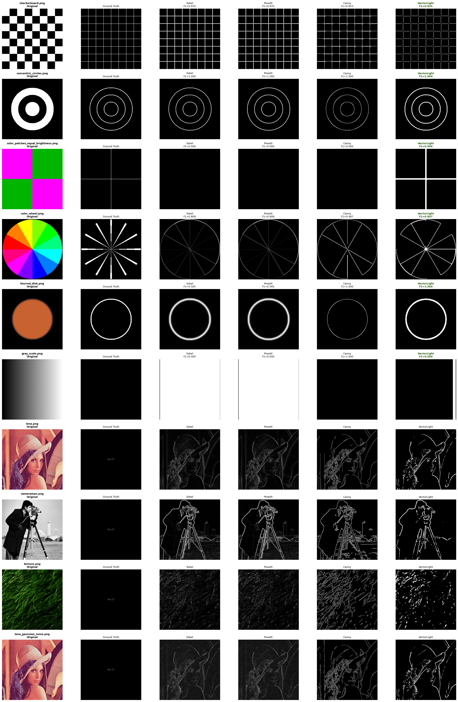

# Vector Lighting Edge Detector

[](https://www.python.org/)
[](LICENSE)
[]()
[](https://doi.org/10.5281/zenodo.19420796)
[](README.ru.md)

A library for edge detection in images. It includes classical methods (Sobel, Prewitt, Canny) and an **original vector lighting method**, designed for effective edge detection on color images.

## Author

**Panchenko Aleksandr Alekseevich**  
Radiophysicist, student  
[Email: sascha.panchenko2018@yandex.ru](mailto:sascha.panchenko2018@yandex.ru)  
[GitHub: https://github.com/Nervni-Sanya](https://github.com/Nervni-Sanya)  
[ORCID: https://orcid.org/0009-0009-9104-1214](https://orcid.org/0009-0009-9104-1214)

## ✨ Features

- **Color sensitivity** – the `vector_lighting` method detects **isoluminant edges** (transitions between different colors of equal brightness). Canny scores **F1 = 0.000** on such edges across every orientation tested; `vector_lighting` stays at ~0.99.
- **Competitive quality** – mean F1 **0.788** on the 6-image synthetic set (default config) and a best of **0.788** across a 20,736-configuration parameter sweep. Comparable to Canny; on real photos (BSDS500) it ties Canny on F1 with the best precision of all detectors.
- **Tunable speed/quality** – ships with presets from `VL-default` (best quality) to `VL-turbo` (~3× faster than Canny). Fast presets beat Sobel/Prewitt on speed while remaining color-sensitive.
- **Scientifically grounded** – default parameters chosen from a brute-force search of **20,736 configurations**.
- **Flexibility** – configurable lighting modes, channel permutations, fusion methods.

> All numbers below are reproducible with the benchmark in `tests/testing.py`. Absolute timings are machine-dependent; speed is reported **relative to Canny**. See [`docs/benchmark_report_2026-06.md`](docs/benchmark_report_2026-06.md) for the full report (orientation, scaling, and real-image studies).

## 📊 Benchmark results

### Synthetic set (F1-score, 2-pixel tolerance, 256×256)

Reproduce with `python tests/testing.py --baseline-only`. Sobel/Prewitt are binarized at their 95th percentile; single-image synthetic scores are sensitive to that choice.

| Image | Sobel | Prewitt | Canny | **VectorLight** |
|-------|:-----:|:-------:|:-----:|:---------------:|
| `checkerboard` | 0.000 | 0.000 | 0.945 | 0.933 |
| `concentric_circles` | 1.000 | 1.000 | 1.000 | 1.000 |
| `color_patches_equal_brightness` | 1.000 | 1.000 | 0.000 | **0.909** |
| `color_wheel` | 0.510 | 0.367 | 0.471 | **0.887** |
| `blurred_disk` | 1.000 | 1.000 | 1.000 | 1.000 |
| `gray_scale` | 1.000 | 1.000 | 1.000 | 0.000 |
| **Mean F1** | 0.752 | 0.728 | 0.736 | **0.788** |

`vector_lighting` leads on the color tests (`color_patches`, `color_wheel`) and trails only on the pure-grayscale ramp, which it is not designed for.

### Color sensitivity (isoluminant edges)

Stripes of equal-brightness colors, evaluated at 12 orientations (`python tests/testing.py --orientation`):

| Method | F1 on isoluminant edges |
|--------|:-----------------------:|
| **VectorLight** | **~0.99** (all orientations) |
| Canny | **0.000** (all orientations) |

Canny cannot see a color boundary without a brightness step. (Sobel/Prewitt appear to score on these synthetic stripes only because of a sub-grayscale brightness residual in the test colors — see the report; on real photos this does not help them.)



### Orientation / anisotropy (diagonal edges)

Does an edge parallel to a virtual light vector become a blind spot? Tested directly:

- **`mode=0`** (1 vector) has a real blind spot — F1 drops to **0.232** for edges parallel to its single light direction (135°).
- **`mode≥1`** has **no blind spots** (F1 ≥ 0.875 at every orientation): light vectors come in perpendicular pairs.
- **`mode=2` is redundant** — it produces **pixel-identical** maps to `mode=1` (the ±L vectors contribute equally because the response is squared).
- **`mode=3`** (default) minimizes anisotropy to ~±8%.

### Performance (speed relative to Canny)

Median of 15 runs on the 256×256 synthetic set (`--baseline-only`). Higher `×` = faster:

| Preset | Config | Mean F1 | Speed vs Canny |
|--------|--------|:-------:|:--------------:|
| `VL-turbo` | mode 1, σ=0, no perms | 0.703 | **≈2.9×** |
| `VL-fast` | mode 1, σ=0.5, no perms | 0.728 | **≈1.9×** |
| Sobel / Prewitt | — | 0.73–0.75 | ≈1.8× |
| Canny | — | 0.736 | 1.0× (baseline) |
| `VL-balanced` | mode 1, perms | 0.783 | ≈0.6× |
| `VL-default` | mode 3, perms | **0.788** | ≈0.3× |

The default config trades speed for quality (~3× slower than Canny). For latency-sensitive use, `VL-fast`/`VL-turbo` match or beat the classical detectors while keeping color sensitivity.

### Real images — BSDS500

Full BSDS500 test split (200 human-annotated photos, union-of-annotators ground truth, tolerance 0.0075×diagonal, fixed thresholds). Reproduce with `python tests/testing.py --bsds /path/to/BSDS500`:

| Method | F1 | Precision | Recall |
|--------|:--:|:---------:|:------:|
| Canny | 0.566 | 0.482 | 0.774 |
| **VL-default** | 0.552 | **0.630** | 0.509 |
| Prewitt | 0.543 | 0.582 | 0.529 |
| Sobel | 0.541 | 0.577 | 0.530 |

On real photos the method is competitive with the classics and has the **highest precision** (fewest false edges).

### Scaling (image size)

`vector_lighting`'s core scales correctly, but the **default `sigma` and `binary_percentile` are calibrated for ~256 px**. At higher resolutions the default config's F1 drops (0.95 → 0.71 from 256² to 2048²), while `VL-turbo` (σ=0, threshold-by-mean) holds F1 ≈ 0.99. **For images larger than ~512 px, use `sigma=0–0.5` and `binary_percentile=0.0`.** Details and timings in the report.

## ⚙️ Parameters of the `vector_lighting` method

| Parameter | Type | Default | Description |
|-----------|------|:-------:|-------------|
| `mode` | `int` | `3` | Lighting mode: `0`=1 vector, `1`=2, `2`=4, `3`=8 vectors. `mode=2` is redundant with `mode=1` (identical output); use `1` or `3`. |
| `sigma` | `float` | `1.0` | Gaussian smoothing. Reduces noise but may blur fine edges. Use `0–0.5` for images > 512 px. |
| `binary_percentile` | `float` | `0.05` | Percentile of pixels for binarization. `0.05` = keep the 5% brightest. `0.0` = threshold by mean. ⚠️ On gradients / large images use `0.0`. |
| `use_permutations` | `bool` | `True` | Iterate over channel permutations. ≈ **+10% F1** on the synthetic set, but ~6× slower. |
| `merge_method` | `str` | `'max'` | Fusion method: `'mean'`, `'max'`, `'adaptive_mean'`, `'weighted'`. `'max'` preserves the strongest response. |
| `threshold_method` | `str` | `'percentile'` | Threshold method: `'mean_std'`, `'median'`, `'percentile'`. |
| `threshold_factor` | `float` | `0.25` | Multiplier for `'mean_std'`. Ignored for `'percentile'`. |
| `height_weight` | `float` | `1.0` | Weight of height (third channel) influence on response. |
| `clean_noise` | `bool` | `False` | Morphological cleaning. ⚠️ Removes fine edges. **Not recommended**. |
| `channel_roles` | `tuple` | `None` | Explicit channel roles `(x, y, z)`. Ignores `use_permutations`. |
| `binary` | `bool` | `True` | Apply binarization. If `False`, returns gradient map. |
| `return_debug` | `bool` | `False` | Return a dict with debug information. |

## 🎯 Configuration recommendations

### For maximum quality (default parameters)

Chosen from a brute-force search of **20,736 configurations**:

```python
from vector_lighting import vector_lighting

edges = vector_lighting(
    image,
    mode=3,                # 8 lighting vectors (minimal anisotropy)
    sigma=1.0,             # Smoothing (use 0–0.5 for >512 px)
    binary_percentile=0.05,# Keep 5% of pixels (use 0.0 for large images)
    use_permutations=True, # All channel permutations (+~10% F1, ~6× slower)
    merge_method='max',
    threshold_method='percentile',
    threshold_factor=0.25,
    height_weight=1.0,
    clean_noise=False,
)
```
Mean F1 = **0.788** on the synthetic set.

### For high speed (faster than Canny, color-sensitive)

```python
edges = vector_lighting(
    image,
    mode=1,                 # 2 vectors (mode=2 would be identical but slower)
    sigma=0.5,
    use_permutations=False, # Disable permutations
)
```
`VL-fast` ≈ 1.9× faster than Canny at F1 ≈ 0.73; `VL-turbo` (`mode=1, sigma=0.0, binary_percentile=0.0`) ≈ 2.9× faster.

## 🙏 Acknowledgments

Generative AI tools (Qwen) were used for code refactoring, optimization, and documentation preparation.

```bash
pip install git+https://github.com/Nervni-Sanya/Edge-detection-benchmark.git
```
